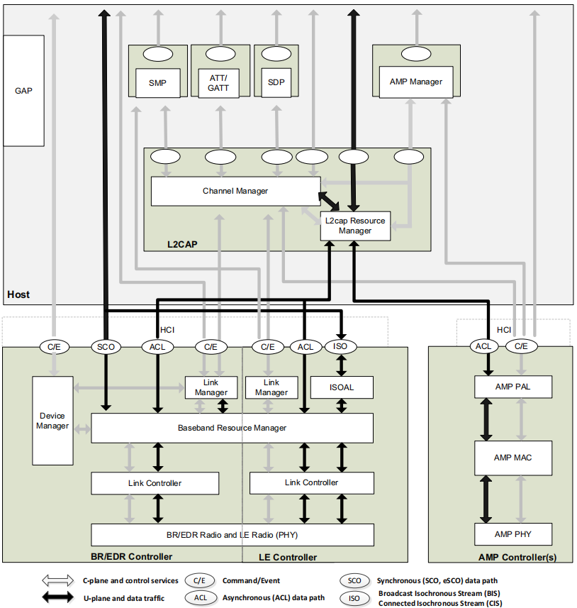
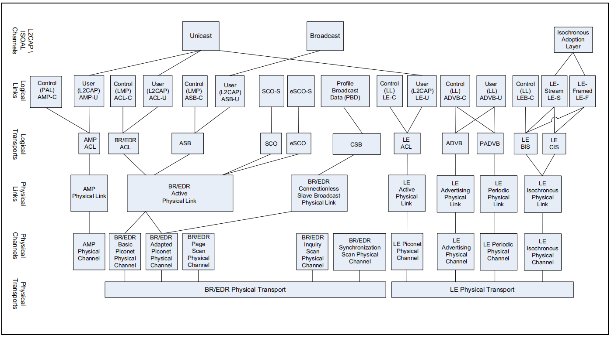
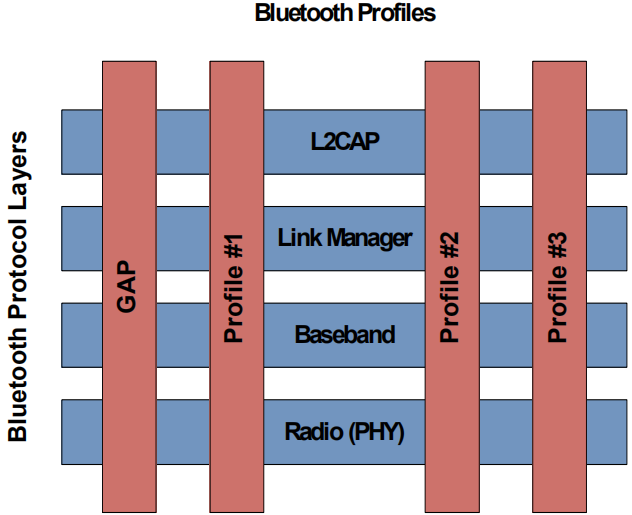
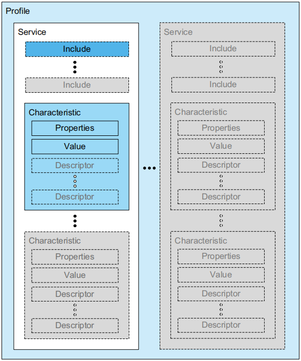

蓝牙架构
========

:基本概念:

* BR: Basic Rate
* EDR: Enhanced Data Rate

  EDR是optional，BR和EDR可以同时存在。

* AMP: Alternate MAC and PHY layer extension

  AMP是alternate，BR/EDR和AMP只能二选一使用。
  BR->EDR->AMP是提升传输速率的发展过程，也将BR/EDR、AMP称为经典蓝牙。

* LE: Low Energy

  LE用于低功耗场景。
  （LE相比BR，差异很大，可以认为是两种不同的蓝牙技术，但都属于蓝牙技术）

核心系统架构（Core System Architecture）
----------------------------------------

..  code:: text

    +-----------------------+
    | Bluetooth Application |
    +-----------------------+
    |    Bluetooth Core     |
    |  +-----------------+  |
    |  |      Host       |  |
    |  +-----------------+  |
    |  |   Controller    |  |
    |  +-----------------+  |
    +-----------------------+

* Application: 蓝牙应用层协议；
* Core: 蓝牙核心协议，关注对蓝牙核心技术的描述和规范；

  一个蓝牙Core包含1个Host，1个Primary Controller，0或多个Sencondary Controllers。

* Core.Controller: 负责RF、Baseband等偏硬件的规范，抽象出逻辑链路（Logical Links）；
* Core.Host: 在逻辑链路基础上封装；

数据传输架构（Data Transport Architecture）
-------------------------------------------

..  code:: text

    +----------+---------------------+
    | APP      | Profiles            |
    +----------+---------------------+
    | L2CAP    | L2CAP Channels      |
    +----------+---------------------+
    |          | Logical Links       |
    | Logical  +---------------------+
    |          | Logical Transports  |
    +----------+---------------------+
    |          | Physical Links      |
    |          +---------------------+
    | Physical | Physical Channels   |
    |          +---------------------+
    |          | Physical Transports |
    +----------+---------------------+

* APP: 基于L2CAP提供的channel，实现各种应用功能
* L2CAP: 逻辑链路和适配协议，负责管理逻辑层提供的逻辑链路，类似TCP/IP中端口的概念
* Logical: 提供多个设备之间、和物理无关的逻辑传输通道（逻辑链路）
* Physical: 负责提供数据传输的物理通道（信道）

数据传输架构中的一些具体协议如下图所示：

物理层（Physical）
''''''''''''''''''

:Physical Transports:

..  code:: text

    The BR/EDR Physical Transport encapsulates the BR/EDR Physical Channels.
    Transfers using the BR/EDR Physical Transport use the BR/EDR Generic Packet Structure.
    The LE Physical Transport encapsulates the LE Physical Channels.
    Transfers using the LE Physical Transport use the LE Generic Packet Structure.

Transports按照Generic Packet Structure封装来自Channels的数据。

:Physical Channels(物理信道):

BR/EDR, AMP, LE的RF均使用2.4GHz~2.4835GHz的频率范围，且定义了各自不同的物理信道。

* BR/EDR
    频率范围分成79个Channel，每个1MHz。设立Lower Guard Band为2MHz，Upper Guard Band为3.5MHz。

* AMP
    AMP为高速数据传设计，物理层直接采用802.11(WIFI)的PHY规范。

* LE
    频率范围分成40个Channel，每个2MHz。设立Lower Guard Band为2MHz，Upper Guard Band为3.5MHz。

    - ``LE Piconet Channel``: 用于已经连接的设备之间的通信。
    - ``LE Advertising Physical Channel``: 用于无连接的广播通信，如蓝牙设备的发现、连接等。

:Physical Links(物理链路):

..  code:: text

    A physical link represents a baseband connection between Bluetooth devices.
    A physical link is always associated with exactly one physical channel
    (although a physical channel may support more than one physical link).

* 跳频技术（hopping）：一个物理链路，并不是固定的占用某一个channel，而是以一定规律跳动。

逻辑层（Logical）
'''''''''''''''''

逻辑层的主要功能，是在已连接的蓝牙设备间（LE Advertisement Broadcast可以看做一类特殊的连接），基于 `Physical Links` ，建立Logical Links，根据传输类型，Logical Links主要包含3类：

- 用于管理底层物理链路的控制类传输：AMP-C, ACL-C, PSB-C, LE-C, ADVB-C
- 传输用户数据的用户类传输：AMP-U, ACL-U, PSB-U, LE-U, ADVU-U
- 其它特殊的传输类型：流式传输(stream), PBD(Profile Broadcast Data)

每个Logic Link在下层对应一个Logical Transport，这些Logical Transport具有一些属性值，如流控、应答/重传机制等。

L2CAP层
'''''''

L2CAP全称为Logical Link Control and Adaptation Protocol(逻辑链路控制和适配协议)。

在ACL-U, ASB-U, LE-U, AMP-U的Logical Links上，L2CAP层抽象出数据传输通道，包括单播（Unicast）和多播（Broadcast）。APP层通过一套面向channel-oriented的接口与L2CAP交互。

应用架构（Bluetooth Application Architecture）
----------------------------------------------

Profiles
''''''''

蓝牙通过 `profile` 来实现应用架构。

对于一个特定蓝牙profile：

* 定义了从PHY到L2CAP每层协议自身所需要的功能和特性；
* 可以定义自身需要，且不包含在蓝牙基本协议之中的协议（即profile可以定义一些只给自身用的协议，其它的profile用不了，也用不到）；
* 定义了PHY到L2CAP协议层，层与层之间之间的交互；
* 定义了设备之间，针对某层协议的peer-to-peer交互；
* 定义了应用的功能和数据格式；
* 定义了设备的发现、连接、查找应用服务、查找连接信息等功能；

说白了，profile是一个纵向协议，从PHY到L2CAP每层协议中都有点东西（不是站在L2CAP上就实现了profile所有功能）；
虽说一个profile也可以被其它profile使用，但profile之间还是是各干各的为主（所以一个蓝牙产品也不需要实现所有的profile，只实现自己需要的即可）；

蓝牙定义了很多profile，使用相同profile的设备之间才可以保证互通性（interoperability）；
一些基本profile：

* GAP(Generic Access Profile): 实现蓝牙设备间的发现、连接等功能；
* SPP(Serial Port Profile): 实现2台蓝牙设备间建立虚拟串口并进行连接；
* GOEP(Generic Object Exchange Profile): 实现数据对象传输，可用于同步、文件传输等；

GAP(Generic Access Profiles)
''''''''''''''''''''''''''''

GAP是一个最基础的 `profile` ，可以实现设备发现、建立连接、安全（security）、授权认证（authentication）、模块组网（association models）和服务发现。

对于LE，GAP定义了4个角色：

* `Broadcaster` 广播者，可以广播数据，不支持连接。
* `Observer` 观察者，用于只接收数据的应用，不支持连接。 `Observer` 和 `Broadcaster` 是两个互补的角色。
* `Peripheral` 周边设备，支持一个连接。
* `Central` 中心设备，支持多个连接。

ATT(Attribute Protocol)
'''''''''''''''''''''''

ATT协议在L2CAP上传输数据。
基于ATT协议，蓝牙设备可以读写保存在server上的数据值，即读写Attribute。Attribute使用UUID来标识自身。

ATT协议定义了2个角色： `Client` 和 `Server` 。
其中ATT Server可以：

* 保存Attribute
* 接收来自ATT Client的request, command, confirmation
* 回应ATT Client的request
* 发送indication和notification

GATT(Generic Attribute Profile)
'''''''''''''''''''''''''''''''

GATT协议基于ATT，实现一些通用操作，以及数据传输框架（数据即保存在ATT中的Attribute）。
GATT同样定义了 `Client` 和 `Server` （GATT中的Server和Client，也即是ATT中的Server和Client）。
GATT中的角色，并不一定需要和GAP中的角色绑定，而是可以直接由profile指定。
对于LE，GATT和ATT是必须要实现的（用于设备发现功能）。

在GATT中，进一步规范了Attribute的数据格式：

* GATT抽象出多个Service
* Service由多个Characteristic组成
* Characteristic包含一个Value和任意数量的Descriptor

GATT的一个举例（手机和运动手环）：

* 运动手环为GATT Server，提供3个Service（设备信息、步数、心率），相关数据保存在手环上；同时运动手环作为 `Peripheral` 设备，会进行广播，以便让手机发现；
    - 设备信息：厂商、版本等Characteristic
    - 步数：步数Characteristic，其中Value为步数数据，Descriptor描述步数单位等信息
    - 心率：心率Characteristic，其中Value为心率数据，Descriptor描述心率单位等信息
* 手机为GATT Client，从运动手环上获取Service数据；手机作为 `Central` 设备，会进行扫描，以便和运动手环进行连接；

Mesh-based model
''''''''''''''''

Mesh profile用于蓝牙设备组网。
