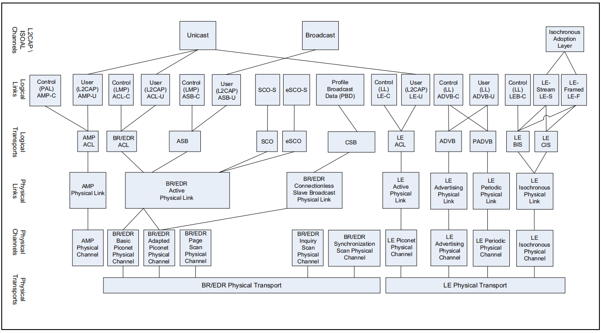

数据传输架构（Data Transport Architecture）
===========================================

::

    +----------+---------------------+
    | APP      | Profiles            |
    +----------+---------------------+
    | L2CAP    | L2CAP Channels      |
    +----------+---------------------+
    |          | Logical Links       |
    | Logical  +---------------------+
    |          | Logical Transports  |
    +----------+---------------------+
    |          | Physical Links      |
    | Physical +---------------------+
    |          | Physical Channels   |
    +----------+---------------------+

* APP: 基于L2CAP提供的channel，实现各种应用功能
* L2CAP: 逻辑链路和适配协议，负责管理逻辑层提供的逻辑链路，类似TCP/IP中端口的概念
* Logical: 提供多个设备之间、和物理无关的逻辑传输通道（逻辑链路）
* Physical: 负责提供数据传输的物理通道（信道）

物理层
------

:Physical Channels(物理信道):

BR/EDR, AMP, LE的RF均使用2.4GHz~2.4835GHz的频率范围。

* BR/EDR
  频率范围分成79个Channel，每个1MHz。设立Lower Guard Band为2MHz，Upper Guard Band为3.5MHz。

* AMP
  AMP为高速数据传设计，物理层直接采用802.11(WIFI)的PHY规范。

* LE

  频率范围分成40个Channel，每个2MHz。设立Lower Guard Band为2MHz，Upper Guard Band为3.5MHz。

  LE定义了 `LE Piconet Channel` 和 `LE Advertisement Broadcast Channel` 2种物理信道。

  - `LE Piconet Channel`: 用于已经连接的设备之间的通信。
  - `LE Advertisement Broadcast Channel`: 用于无连接的广播通信，如蓝牙设备的发现、连接等。

:Physical Links(物理链路):

- 跳频技术（hopping）：一个物理链路，并不是固定的占用某一个channel，而是以一定规律跳动。

BR/EDR、AMP、LE三种技术定义了各自不同的物理链路。

逻辑层
------

逻辑层的主要功能，是在已连接的蓝牙设备间，基于 `Physical Links` ，建立Logical Links，根据传输类型，Logical Links主要包含3类：

- 用于管理底层物理链路的控制类传输：AMP-C, ACL-C, PSB-C, LE-C, ADVB-C
- 传输用户数据的用户类传输：AMP-U, ACL-U, PSB-U, LE-U, ADVU-U
- 其它特殊的传输类型：流式传输（stream）, PBD(Profile Broadcast Data)

每个Logic Link在下层对应一个Logical Transport，这些Logical Transport具有一些属性值，如流控、应答/重传机制等。

L2CAP层
-------

L2CAP全称为Logical Link Control and Adaptation Protocol(逻辑链路控制和适配协议)。

在ACL-U, ASB-U, LE-U, AMP-U的Logical Links上，L2CAP层抽象出数据传输通道，包括单播（Unicast）和多播（Broadcast）。APP层通过一套面向channel-oriented的接口与L2CAP交互。

