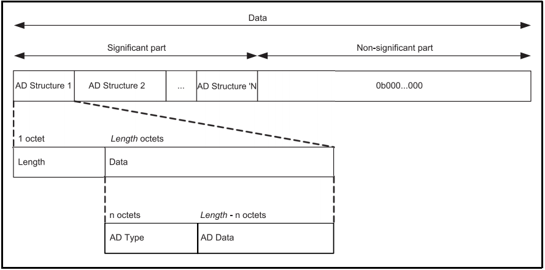

Host
====

GAP(Generic Access Profiles)
----------------------------

Advertising and Scan Response data format
'''''''''''''''''''''''''''''''''''''''''

广播、周期广播、扫描响应的PDU数据格式如下：

其中的 `AD Type` 可以在 `AssignedNumbers <https://www.bluetooth.com/specifications/assigned-numbers/>`_ 查询。

例如： `GAP中使用AD类型 <https://www.bluetooth.com/specifications/assigned-numbers/generic-access-profile/>`_
