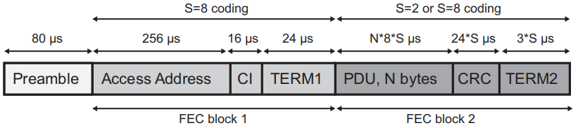

蓝牙低功耗协议（Bluetooth Low Enery）
=====================================

..  image:: img/ble.gif
    :scale: 80 %
    :align: center

Physical Layer
--------------

物理层描述是BLE在物理上怎么进行通信的，即使用调制过的电磁波信号作为通信介质。

BLE定义了2种信号调制方式（modulation scheme）：

+-------------------+----------+-------------------------+-----------+
|                   |          | Coding scheme           |           |
| Modulation scheme | PHY      +---------------+---------+ Data rate |
|                   |          | Access Header | Payload |           |
+-------------------+----------+---------------+---------+-----------+
|                   | LE 1M    | Uncoded       | Uncoded | 1 Mb/s    |
|                   +----------+---------------+---------+-----------+
| 1 Msym/s          |          |               | S = 2   | 500 Kb/s  |
|                   | LE Coded | S = 8         +---------+-----------+
|                   |          |               | S = 8   | 125 Kb/s  |
+-------------------+----------+---------------+---------+-----------+
| 2 Msym/s          | LE 2M    | Uncoded       | Uncoded | 2 Mb/2    |
+-------------------+----------+---------------+---------+-----------+

BLE使用2.4GHz~2.4835GHz的频率范围，将频率范围分成40个Channel，每个2MHz，称为RF Channel。

..  math::
    freq = 2402 + k * 2MHz, k = 0, ..., 39

Link Layer
----------

Link Layer的主要功能，即是使用Physical Layer的RF Channel收发数据。

基本术语
''''''''

:Bit Ordering:

BLE的Byte数据传输使用小端格式（Little Endian），Bit传输按如下规则：

* 最低有效位LSB(Least Significant Bit)指第0位(:math:`b_0`)；
* 一个Byte，从LSB开始传输；
    例如，一个Byte = 0x13 = 0b0001_0011，则有传输的Bit依次为 `1 1 0 0 1 0 0 0`

:状态（States）:

可以用状态机来描述Link Layer的操作。

..  image:: img/ble-state.png
    :scale: 60 %
    :align: center

* Standby
    不收发数据，可以任意其它状态转入；

* Advertising
    传输广播通道的数据；

* Scanning
    监听Advertising设备的广播数据；

* Initiating
    监听Advertising设备的connectable广播数据，收到数据后，发送连接请求，和Advertiser建立加接；连接成功后，Initator和对应的Advertiser均转入Connection状态；

* Connection
    建立连接后的状态；并且，Initator成为Master设备，Advertiser成为Slave设备；

* Synchronization
    监听periodic physical channel packets；

* Isochronous Broadcasting
    传输isochronous数据包；

空中接口协议（Air Interface Packets）
'''''''''''''''''''''''''''''''''''''

（协议的详细说明，请参照 `bluetooth core specification <https://www.bluetooth.com/zh-cn/specifications/bluetooth-core-specification/>`_ ）

LE Uncoded PHY Packet
"""""""""""""""""""""

LE Uncoded PHY包括LE 1M和LE 2M两种PHY，数据包格式如下：

图中，使用LE 1M PHY收发时，preamble占1个字节；使用LE 2M PHY收发时，preamble占2个字节。
传输次序依次为 `preamble`, `Access Address`, `PDU`, `CRC`, `Constant Tone Extension` 。

LE Coded PHY Packet
"""""""""""""""""""

LE Coded PHY数据包格式如下：

整个数据包由3部分组成： `preamble`, `FEC block1`, `FEC block2` 。

preamble不用编码(coding)；
FEC block1使用S=8编码；
FEC block2使用S=2或S=8编码，具体由 `FEC block1` 中的 `CI` 决定。

Advertising Physical Channel PDU
""""""""""""""""""""""""""""""""

(Advertising physical channel PDU也用在periodic physical channel)

Advertising Physical Channel PDU由一个16-bit的header和一个指定长度的payload组成：

其中header的各个字段如下：

..  image:: img/apc-pdu-header.png
    :scale: 80 %
    :align: center

按照 `PDU Type` 可以将PDU分成以下几类：

* 广播PDU（Advertising PDU）
    - ADV_IND
    - ADV_DIRECT_IND
    - ADV_NONCONN_IND
    - ADV_SCAN_IND
    - ADV_EXT_IND
    - AUX_ADV_IND
    - AUX_SYNC_IND
    - AUX_CHAIN_IND

* 扫描PDU（Scanning PDU）
    - SCAN_REQ
    - SCAN_RSP
    - AUX_SCAN_REQ
    - AUX_SCAN_RSP

* 初始化PDU（Initiating PDU）
    - CONNECT_IND
    - AUX_CONNECT_REQ
    - AUX_CONNECT_RSP

Data Physical Channel PDU
"""""""""""""""""""""""""

Data Physical Channel PDU由一个16-bit或24-bit的header和一个指定长度的payload组成：

其中header的各个字段如下：

* LL Data PDU
    用于发送L2CAP数据

* LL Control PDU
    用于控制Link Layer连接

Isochronous Physical Channel PDU
""""""""""""""""""""""""""""""""

Isochronous Physical Channel PDU由一个16-bit的header和一个指定长度的payload组成：

其中header的各个字段如下：

