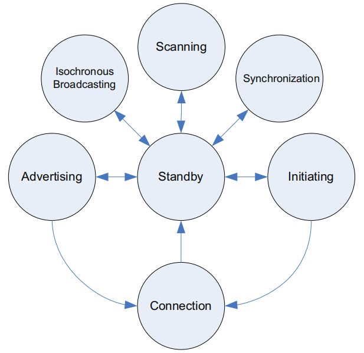

蓝牙低功耗协议(Bluetooth Low Enery)
===================================

Physical Layer
--------------

BLE将频率范围分成40个Channel，每个2MHz，称为RF Channel。

..  math::
    freq = 2402 + k * 2MHz, k = 0, ..., 39

Link Layer
----------

Link Layer的主要功能，就是在Physical Layer上收发数据。

:States:

- Standby: 不收发数据，可以任意其它状态转入；
- Advertising: 传输广播通道的数据；
- Scanning: 监听Advertising设备的广播数据；
- Initiating: 监听Advertising设备的connectable广播数据，收到数据后，发送连接请求，和Advertiser建立加接；连接成功后，Initator和对应的Advertiser均转入Connection状态；
- Connection: 建立连接后的状态；并且，Initator成为Master设备，Advertiser成为Slave设备；
- Synchronization: 监听periodic physical channel packets；
- Isochronous Broadcasting: 传输isochronous数据包；
